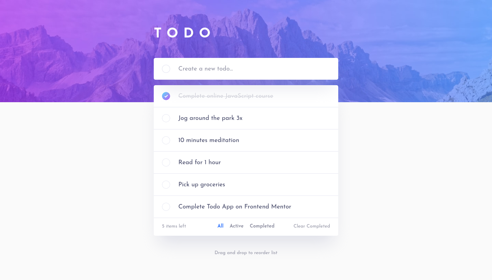
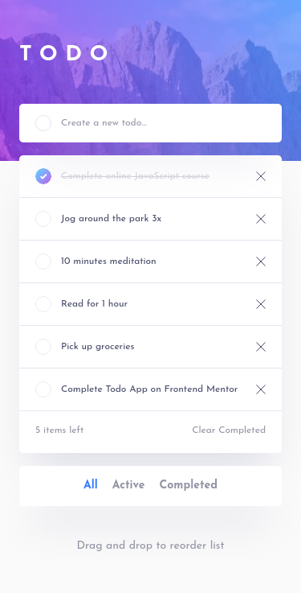

# Frontend Mentor - Todo app solution

This is a solution to the [Todo app challenge on Frontend Mentor](https://www.frontendmentor.io/challenges/todo-app-Su1_KokOW). Frontend Mentor challenges help you improve your coding skills by building realistic projects.

## Table of contents

- [Overview](#overview)
  - [The challenge](#the-challenge)
  - [Screenshots](#screenshots)
  - [Links](#links)
- [My process](#my-process)
  - [Built with](#built-with)
  - [What I learned](#what-i-learned)
  - [Continued development](#continued-development)
  - [Useful resources](#useful-resources)
- [Author](#author)
- [Acknowledgments](#acknowledgments)

## Overview

### The challenge

Users should be able to:

- [x] View the optimal layout for the app depending on their device's screen size
- [x] See hover states for all interactive elements on the page
- [x] Add new todos to the list
- [x] Mark todos as complete
- [x] Delete todos from the list
- [x] Filter by all/active/complete todos
- [x] Clear all completed todos
- [ ] Toggle light and dark mode
- [ ] **Bonus**: Drag and drop to reorder items on the list

### Screenshots

<!-- Light Mode -->



### Links

- Solution URL: TBD
- Live Site URL: TBD

## My process

### Built with

- Semantic HTML5 markup
- Flexbox
- CSS Grid
- Mobile-first workflow
- [React](https://reactjs.org/) - JS library
- [Tailwind CSS](https://tailwindcss.com/)
- [Vite](https://vitejs.dev/) for development and bundling

<!-- ### What I learned

Use this section to recap over some of your major learnings while working through this project. Writing these out and providing code samples of areas you want to highlight is a great way to reinforce your own knowledge.

To see how you can add code snippets, see below:

```html
<h1>Some HTML code I'm proud of</h1>
```

```css
.proud-of-this-css {
  color: papayawhip;
}
```

```js
const proudOfThisFunc = () => {
  console.log('🎉');
};
```

If you want more help with writing markdown, we'd recommend checking out [The Markdown Guide](https://www.markdownguide.org/) to learn more.

**Note: Delete this note and the content within this section and replace with your own learnings.** -->

### Continued development

- Improve project structure and organization
- Get better at Tailwind

### Useful resources

- [Inclusively Hiding & Styling Checkboxes and Radio Buttons](https://www.sarasoueidan.com/blog/inclusively-hiding-and-styling-checkboxes-and-radio-buttons/#hiding-the-checkboxes-inclusively)
- [A Todo List](https://inclusive-components.design/a-todo-list/)
- [Responsive Images: If you’re just changing resolutions, use srcset.](https://css-tricks.com/responsive-images-youre-just-changing-resolutions-use-srcset/)
- [Equal Columns With Flexbox: It’s More Complicated Than You Might Think](https://css-tricks.com/equal-columns-with-flexbox-its-more-complicated-than-you-might-think/)

## Author

- Website - [Josh Javier](https://joshjavier.com/)
- Frontend Mentor - [@joshjavier](https://www.frontendmentor.io/profile/joshjavier)
